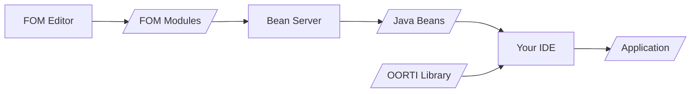

[](https://central.sonatype.com/artifact/nl.tno/beanserver)
[](https://javadoc.io/doc/nl.tno/beanserver) 

# Java Bean Server

This project provides functionality to generate Java Beans from HLA FOM modules, and to dynamically compile these Java Beans into executable code. The Java Beans can be processed by the [Object Oriented RTI (OORTI)](https://github.com/TNO-MST/object-oriented-rti).

The typical workflow is illustrated in the following figure.



An HLA FOM module is created with an HLA FOM Editor. The Bean Server expands each FOM module to a set of Java Beans. The Java Beans can be imported in your development environment (IDE) for the development of an HLA application.

## Building and running with Docker

To build and run the container with Docker, simply run:

```sh
docker compose up -d
```

## Build the Bean Server manually

To build the Bean Server use the following Maven command:

```
mvn clean install
```

## Use the Bean Server manually

From the command line, start the Bean Server with:

```
mvn exec:exec
```

When started, navigate to `http://localhost:7000`. From the provided page Bean generation and compilation options can be provided. The provided FOM modules must form a complete set where all classes and datatypes are defined, in order for the generation or compilation to be successful.

### Bean Server FOM modules

Via the Bean Server web UI two sets of FOM modules can be provided:

- FOM modules for expansion to Java code, including an optional MIM;
- FOM modules that are not for expansion (so called _referenced modules_),

If a FOM module is in the set of referenced modules then it will not be expanded to Java Beans. However, other FOM modules that are expanded can refer to classes and datatypes defined in a referenced FOM module as if the FOM module is expanded. For these references to necessary Java import statements are generated.

For the HLA MIM:

- If a MIM is provided then the provided MIM is added to the set of FOM modules for expansion.
- If no MIM is provided then the HLA standard MIM is added to the set of FOM modules for reference.

### Bean Server configuration

The following configuration options are available to control the Java Bean expansion.

- Use fully qualified Java class name based on OMT class name
- Use Java List type for OMT array datatype
- Use Java public modifier for class properties
- Use boxed or unboxed datatypes for attribues or parameters

In addition a group ID can be set that will be added to the Java package names.

Also, regex based mappings can be added to map a FOM filename to a Java package name.

If a boxed datatype is selected for class attributes/parameters then, for instance, the (boxed) Java type `Integer` is used instead of the (unboxed) Java type `int`. A boxed datatype allows the use of a `null` value for an attribute/parameter, which is ignored by the OORTI when sending an interaction or updating an attribute value.

A checkbox is available to instruct the Bean Server to compile the generated Java Beans to a JAR file.

# Documentation

The `Bean Server` provides a web UI to the back-end `Bean Generator` and `Bean Compiler`. The `Bean Generator` provides methods to generate Java Beans from FOM modules. The `Bean Compiler` provides methods to generate Java Beans and compile these to a JAR file. Further documentation is under the following links.

- [Bean Generator](doc/BeanGenerator.md)
- [Bean Compiler](doc/BeanCompiler.md)
- [Bean Construction](doc/BeanConstruction.md)
